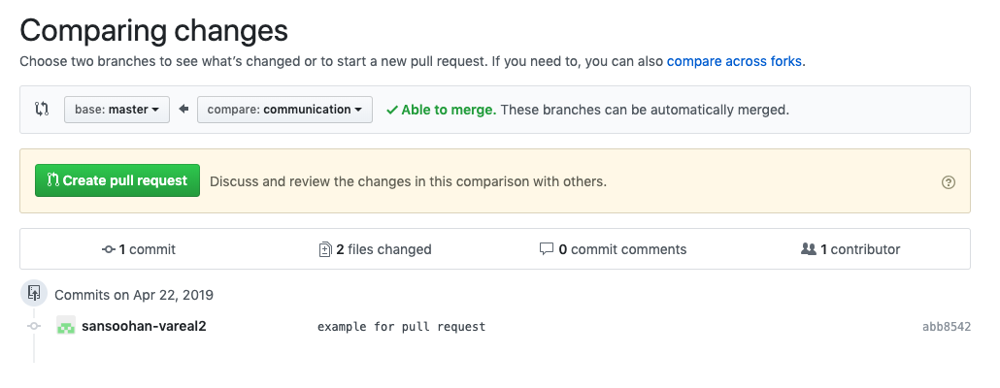
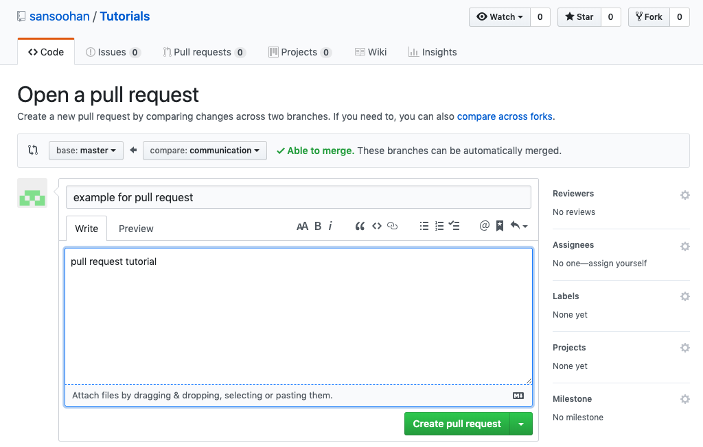
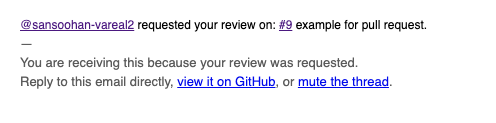
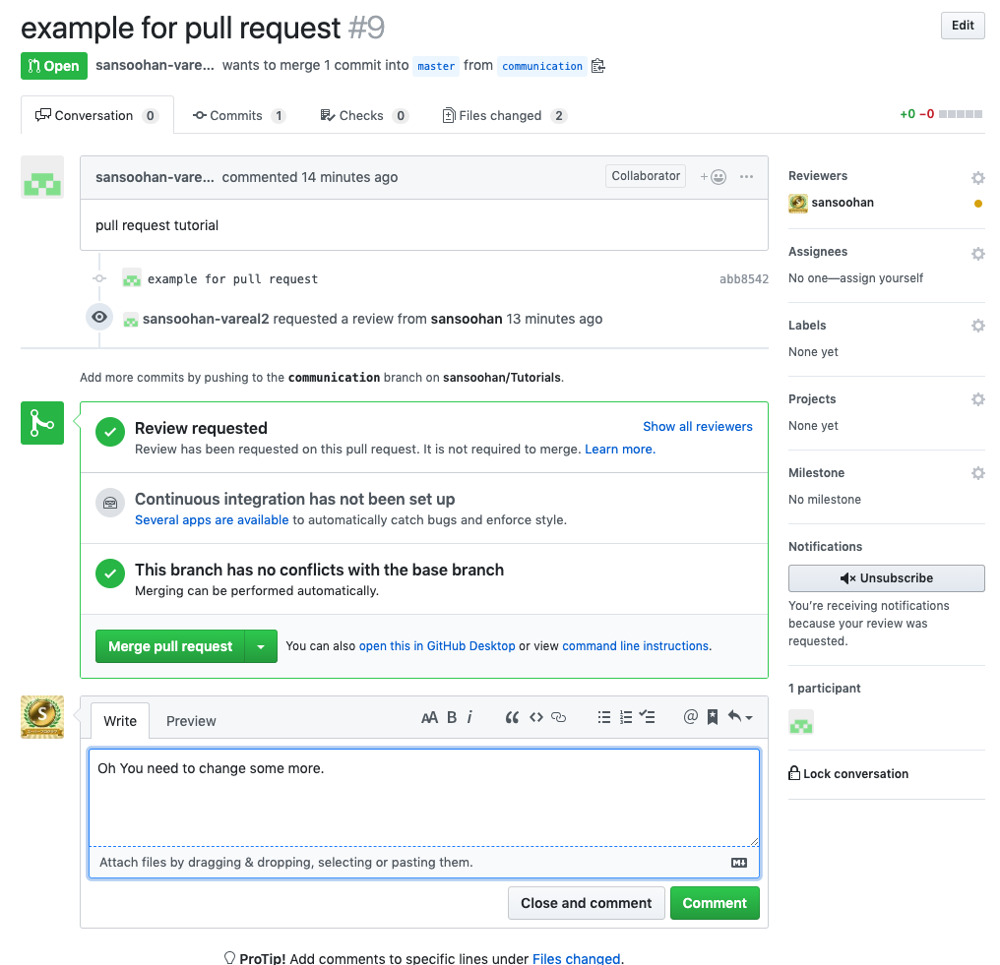
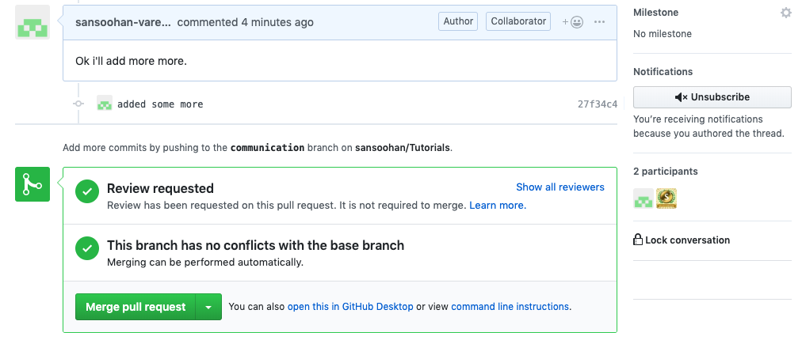

GitTutorial
==================================

Several Branch
-------------------------
Having Several Branch, You can see history of each branch easy.<br>
Without Several Branch, It is hard to find the commits you want.<br>
It is good for working each other, but it is also good to see the change exactly only what you want.<br>
<br>
Show Branch Status<br>
```
git branch
```
Make New Branch<br>
```
git branch folder1
```
Move to Target Branch<br>
```
git checkout folder1
```
Check All Branches Merged Or Not<br>
```
git log
```
Merge Branch to Target Branch<br>
```
git checkout master
git merge folder1
```
Remove Old Branch<br>
```
git branch -d folder
```

Several Repository
------------------------------
Cloning all of project is so heavy.<br>
No one wants to git clone a whole bunch of different repositories one at a time.<br>


Add New Repository<br>
```
git add newrepo [url]
```
Show All Repository<br>
```
git remote -v
```
Remove Old Repository<br>
```
git remove newrepo
```
Rename A Repository<br>
```
git rename newrepo activerepo
```

<a href="https://help.github.com/en/articles/creating-a-personal-access-token-for-the-command-line">Two Factor Athentication</a>
-------------------------------
If you set two factor athentication, You need to get token for athentication.<br>
It will be used in command line. for example, git push.<br>


How to sign out in command line.
-------------------------------
If you have several git account, you might use this command someday.<br>
You can excute these code for signing out on git command line.<br>

save-password-and-id<br>
```
git config credential.helper store
```
git-logout<br>
```
#!/bin/bash
# Logout current GitHub credentials and remove global user.name, user.email

echo -e "host=github.com\nprotocol=https\n" | git credential-osxkeychain erase
git config --unset-all --global user.name
git config --unset-all --global user.email
```

How to roll back?
------------------------------
If you commited some worng document, you can roll back.<br>
```
git reset --hard HEAD^
```
If you pushed some worng document, you can roll back.<br>
```
git reset --hard HEAD^
git push -f
```

Code Review And Pull Request
------------------------------
To avoid merge collision don't upload into master branch directly<br>
upload into branch first<br>
```
git checkout communication
git add *
git commit -m "what is changed"
git push origin communication
```
<br>
<br>
<br>
<br>
<br>
<br>
<br>
<br>
upload again<br>
```
git checkout communication
git add *
git commit -m "added some more"
git push origin communication
```
<br>
<br>
<br>
backup your project<br>
```
mkdir backup
mv yourproject backup/yourproject
```
clone your project again and change your branch<br>
```
git clone https://github.com/projectMasterGithubUserName/yourproject
cd yourproject
git checkout communication
```
delete your local commit before you commit<br>
```
git reset --hard HEAD^
```
delete your github commit before you pushed<br>
```
git push -f
```
delete your project you cloned<br>
```
cd ..
rm -rf yourproject
```
bring your project from backup directory and remove what you did wrong<br>
```
mv backup/yourproject yourproject
```
upload again<br>
```
git add *
git commit -m "I removed what i did wrong and added more."
git push origin communication.
```
