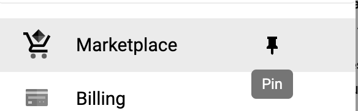
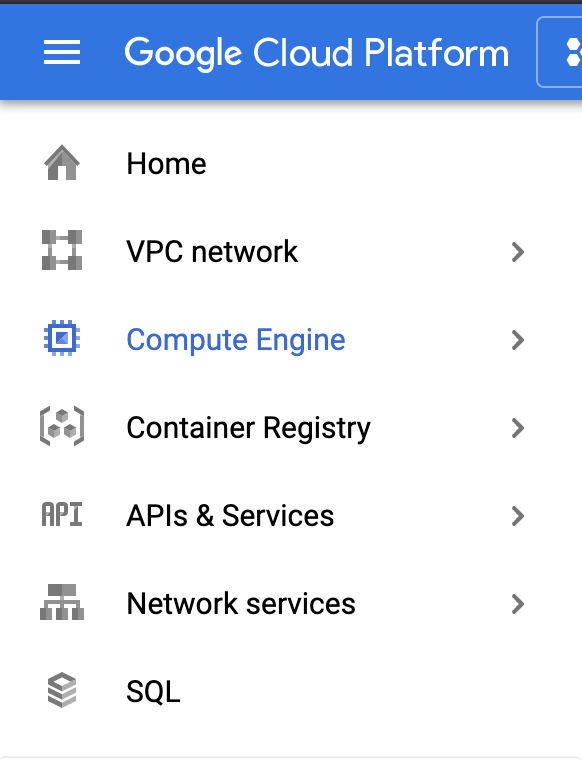
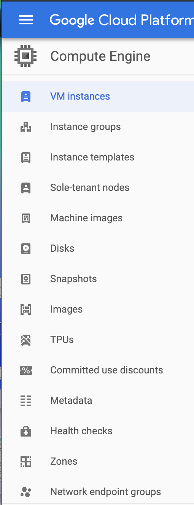
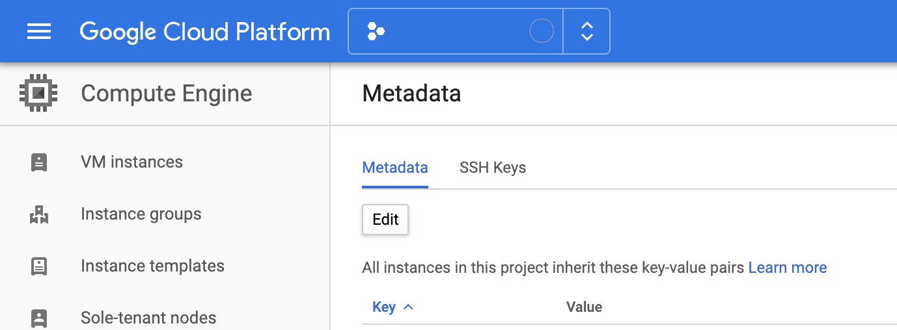
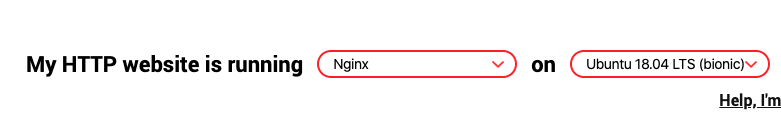
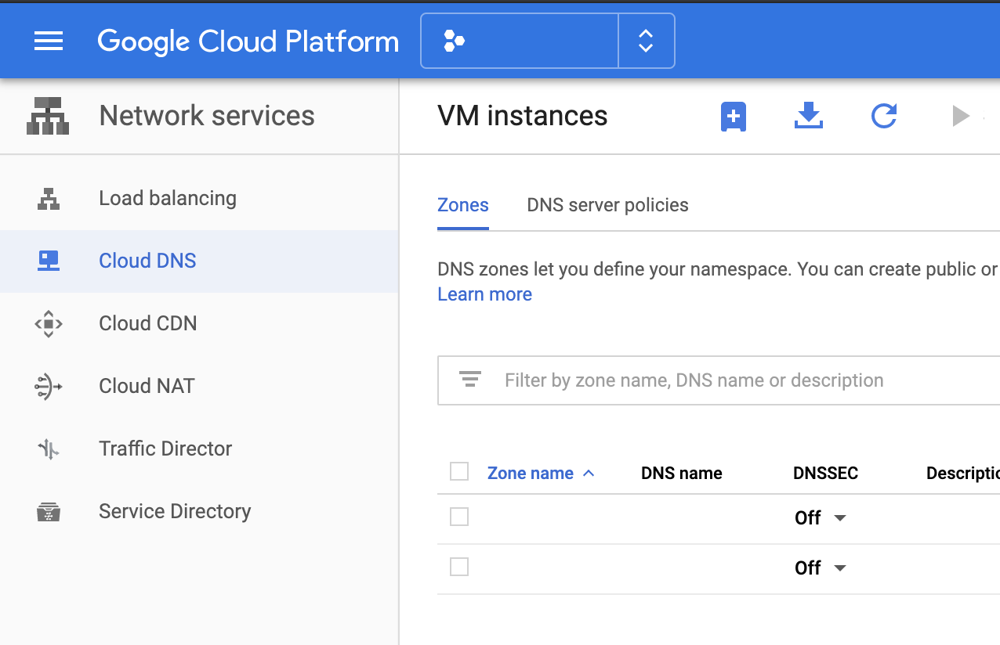
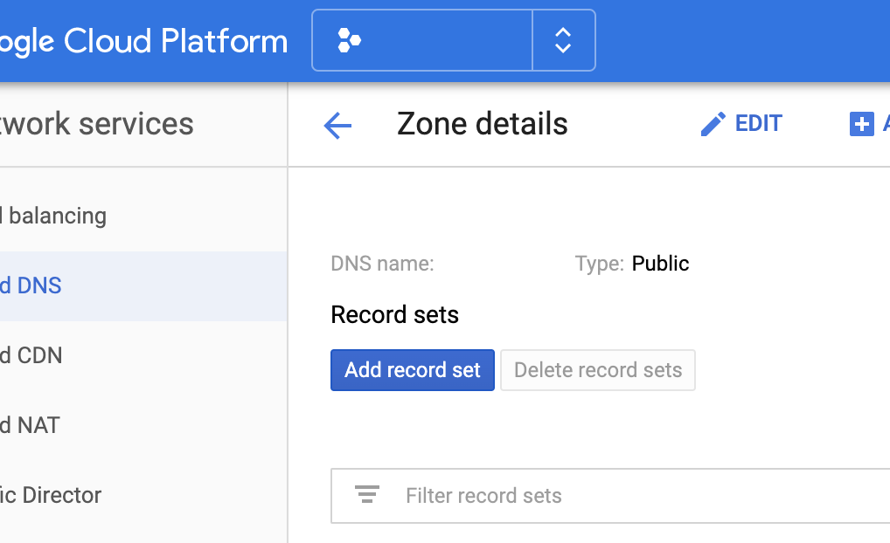
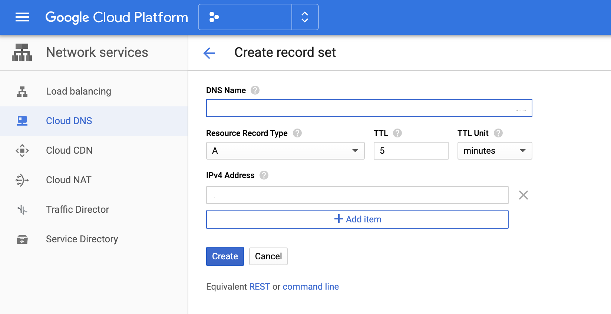

# Small Size Infra Setup Guide

1. [infra-controll-environmet-on-gcp](#infra-controll-environmet-on-gcp)
2. [makebackup-instance](#makebackup-instance)
3. [nginx-config](#nginx-config)
4. [lets-encrypt-and-nginx](#lets-encrypt-and-nginx)
5. [set-instance-static-ip](#set-instance-static-ip)
6. [setup-dns](#setup-dns)

# Infra Controll Environmet on GCP
- Pin the Services you use

  
- I recommend you to pin these Services

  
- Add your SSH Pub key on your project(It allow you to access the instances)
  - Select your project

    
  - Go Compute Engine > Metadata

    
  - SSH keys -> Edit

    
   - Add you ssh-pub key from your computer and save it.
     - you can see your ssh-pub key
        ```
        cat ~/.ssh/id_rsa.pub
        ```
     - If there is no ssh-pub key, you need to make one
        ```
        ssh-keygen
        ```
# Make/Backup Instance
- Backup Stopped Instance
  - Go Compute Engine > Images

    
  - Create New Image

    
    -  Insert These Data and create
       - Name : (Example : InstanceName202004161225)
       - Source : Disk
       - Source disk : (Select Stopped Instance)
- Backup Running Instance
  - Go Compute Engine > Snapshots

    
  - Create snapshot

    
    -  Insert These Data and create
       - Name : (Example : InstanceNameSnapshot202004161225)
       - Source disk : (Select Stopped Instance)
     - Create Instance with snapshot

       - Go Compute Engine > VM instance > Create

          
        -  Insert These Data and create
           - Name : (Example : InstanceName202004161225)
           - Region : (Same region with other instance)
           - Machine type
           - Boot disk : (Select Snapshop)
           - Disks : uncheck Delete boot disk when instance is deleted
   - Remove Instance you just made
   - Create Image with the disk remaining
     - Go Compute Engine -> Images
     - Create Image with instance name you removed


# Let's Encrypt and Nginx
- Install Nginx
  ```
  sudo apt-get update
  sudo apt-get install nginx
  ```
- Check SSL already made
  ```
  cd /etc/letsencrypt/live
  ```
- Make certbot SSL(Let's Encrypt)
  - Go https://certbot.eff.org/ and Select Remote OS and Nginx

    
  - Install Certbot
  - Make SSL
    - For Nginx
      ```
      sudo certbot --nginx
      ```
      - Make Nginx Config with SSL
        ```
        vi /etc/nginx/sites-available/xxx.example.com
        ```
        - [Nginx Config Example](#nginx-config)
      - Set Nginx Config
        ```
        ln -s /etc/nginx/sites-available/xxx.example.com /etc/nginx/sites-enabled/xxx.example.com
        ```
      - Check Nginx Config before update nginx config
        ```
        nginx -t
        ```
      - Restart Nginx and update nginx config
        ```
        sudo systemctl restart nginx
        ```
      - Check Nginx Status
        ```
        sudo systemctl status nginx
        ```

    - For Common use
      ```
      sudo certbot certonly --standalone
      ```
    - For Serveral Domain
        ```
        certbot certonly --manual -d *.example.com
        ```
- Remove SSL
  - Remove SSL
    ```
    sudo certbot revoke --cert-pat=/etc/letsencrypt/live/xxx.example.com/cert.pem
    ```
  - Unset Nginx Config(If it is related with nginx)
    ```
    rm /etc/nginx/sites-enabled/xxx.example.com
    ```

# Nginx Config
- For Single Instance
  - DataFlow
    - Nginx get 443 port -> unix:///home/deployer/app/myapp/shared/tmp/sockets/puma.sock
    - How to rails run for this
      ```
      rails s -b 
  - Config Example
    ```
    upstream app-server {
      server unix:///home/deployer/app/myapp/shared/tmp/sockets/puma.sock fail_timeout=0;
    }

    server {
      listen [::]:443 ssl ipv6only=on; # managed by Certbot
      listen 443 ssl; # managed by Certbot
      ssl_certificate /etc/letsencrypt/live/myapp.com/fullchain.pem; # managed by Certbot
      ssl_certificate_key /etc/letsencrypt/live/myapp.com/privkey.pem; # managed by Certbot      
      
      server_name myapp.com, stage.myapp.com;

      root /home/deployer/app/myapp/current/public;
      access_log /home/deployer/app/myapp/shared/log/nginx-access.log;
      error_log /home/deployer/app/myapp/shared/log/nginx-error.log;
      error_page 404 /404.html;
      location /404.html { root /home/deployer/app/myapp/current/public; }
      error_page 500 /500.html;
      location /500.html { root /home/deployer/app/myapp/current/public; }
      client_max_body_size 4G;
      keepalive_timeout 10;
      location ^~ /assets/ {
        gzip_static on;
        expires max;
        add_header Cache-Control public;
      }
      try_files $uri/index.html $uri @app-server;
      location @app-server {
        proxy_set_header X-Real-IP $remote_addr;
        proxy_set_header X-Forwarded-For $proxy_add_x_forwarded_for;
        proxy_set_header Host $http_host;
        proxy_set_header X-Forwarded-Proto https;
        proxy_set_header X-Forwarded-Ssl on;
        proxy_read_timeout 30;
        proxy_redirect off;
        proxy_pass http://app-server;
      }
    }
    ```


- For Load Balanced Instance
  - DataFlow
    - You don't need to make SSL for nginx
      - Load Balancer Frontend will catch 443 and pass to Instance 80
    - Nginx get 80 port -> unix:///home/deployer/app/myapp/shared/tmp/sockets/puma.sock
    - How to rails run for this
      ```
      rails s -b /home/deployer/app/myapp/shared/tmp/sockets/puma.sock
      ```
  - Example
    ```
    upstream app-server {
      server unix:///home/deployer/app/myapp/shared/tmp/sockets/puma.sock fail_timeout=0;
    }

    server {
      listen 80;
      
      server_name myapp.com, stage.myapp.com;

      root /home/deployer/app/myapp/current/public;
      access_log /home/deployer/app/myapp/shared/log/nginx-access.log;
      error_log /home/deployer/app/myapp/shared/log/nginx-error.log;
      error_page 404 /404.html;
      location /404.html { root /home/deployer/app/myapp/current/public; }
      error_page 500 /500.html;
      location /500.html { root /home/deployer/app/myapp/current/public; }
      client_max_body_size 4G;
      keepalive_timeout 10;
      location ^~ /assets/ {
        gzip_static on;
        expires max;
        add_header Cache-Control public;
      }
      try_files $uri/index.html $uri @app-server;
      location @app-server {
        proxy_set_header X-Real-IP $remote_addr;
        proxy_set_header X-Forwarded-For $proxy_add_x_forwarded_for;
        proxy_set_header Host $http_host;
        proxy_set_header X-Forwarded-Proto https;
        proxy_set_header X-Forwarded-Ssl on;
        proxy_read_timeout 30;
        proxy_redirect off;
        proxy_pass http://app-server;
      }
    }
    ```

# Set Instance Static IP
- You can set Static IP for each Instance
- Go VPC network > External IP Address
  - Reserve a static address with these data
    - Name
    - Region
    - Attated to

# Setup DNS
- Go Network services > Cloud DNS

  

  - Get some DNS from the sites(If you don't have one)
    - For example : https://www.freenom.com/en/index.html?lang=en
    - Create Zone
  - go one of zone > Add record set

     
  - Insert DNS record : Static IP

    
